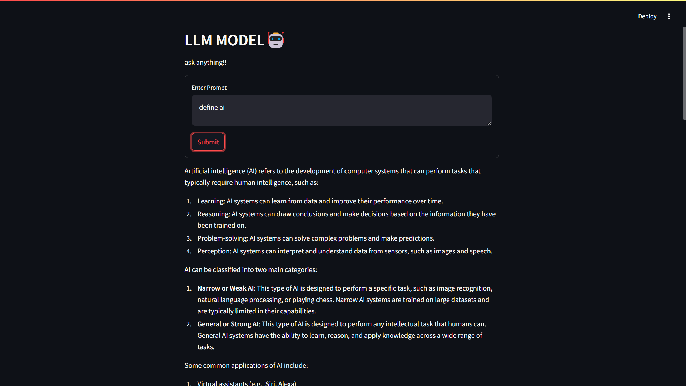

# Ollama GPT


Here’s a brief description for your Ollama GPT:

Ollama GPT is a powerful AI-driven model that utilizes the latest advancements in natural language processing. Built on the Ollama platform, it is designed to seamlessly integrate with applications, providing robust conversational capabilities. 


## Installation

1.Install the Ollama Application

Download and install the Ollama application from the "ollama.com".
Complete the installation process.

2.Install the Ollama Model

Download the llama3.2:latest model from the Ollama GitHub repository.
Use the following command to install the model locally:

```bash
ollama pull llama3.2:latest  
```
3.Verify Model Installation

Run the following command to check if the model is installed correctly:    
```bash
ollama run llama3.2:latest  
```
4.Set Up the Virtual Environment

Create a virtual environment in your project directory
```bash
python -m venv env  
```
Activate the virtual environment:

```bash
.\env\Scripts\activate   
```
Install the required Python modules:
```bash
pip install langchain langchain-ollama ollama streamlit  
```
5.Set Up the Application:

Paste the "app.py" code into your main file.
## To Run 

Run the Application:


```bash
streamlit run <filename>.py
```
# Screenshot



